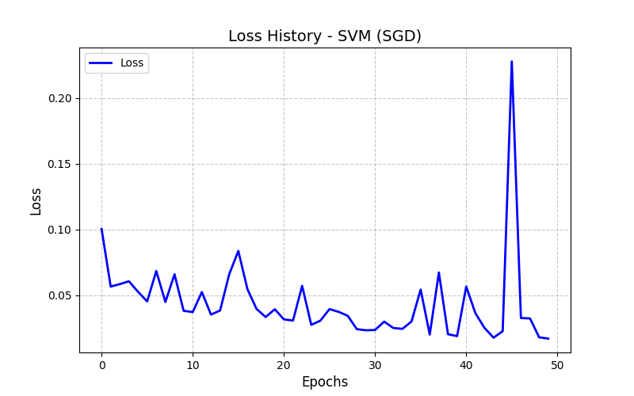
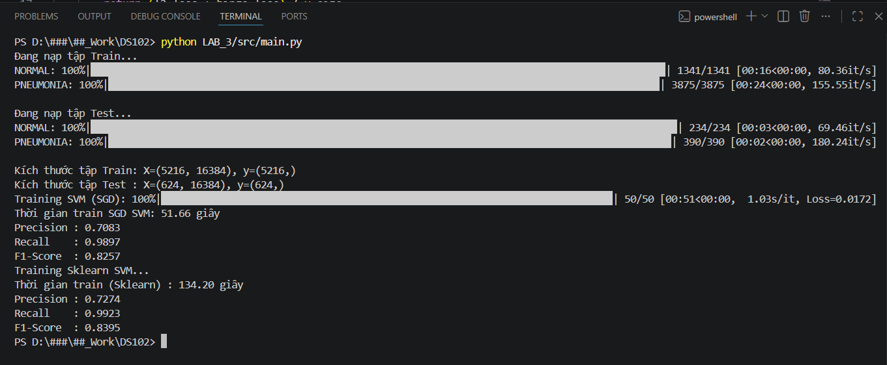

## LAB 3

| Mô hình | Precision | Recall | F1-Score | Thời gian Huấn luyện |
| :--- | :---: | :---: | :---: | :---: |
| **SVM (SGD)** | 0.7083 | 0.9897 | 0.8257 | 51.66 giây |
| **SVM (Sklearn `LinearSVC`)** | 0.7274 | 0.9923 | 0.8395 | 134.20 giây |

### Biểu đồ Loss & kết quả terminal

### Nhận xét

* Đánh giá: Cả hai mô hình đều đạt điểm Recall rất cao (>0.98). Điều này xuất phát từ việc tập dữ liệu bị mất cân bằng (Pneumonia nhiều gấp 3 lần Normal). 
* So sánh SGD SVM (Numpy) và Thư viện Sklearn: 
    * Độ chính xác: `LinearSVC` của Sklearn nhỉnh hơn một chút về F1-Score (0.8395 so với 0.8257).
    * Tốc độ: Thuật toán tự xây dựng bằng SGD nhanh hơn gấp 2.6 lần. Vì dữ liệu ảnh có số lượng đặc trưng lớn (16,384), việc SGD cập nhật trọng số cho từng điểm dữ liệu cho tốc độ hội tụ nhanh hơn đáng kể so với việc giải quyết bài toán tối ưu hoàn toàn của LinearSVC trên tập dữ liệu có số chiều lớn.
